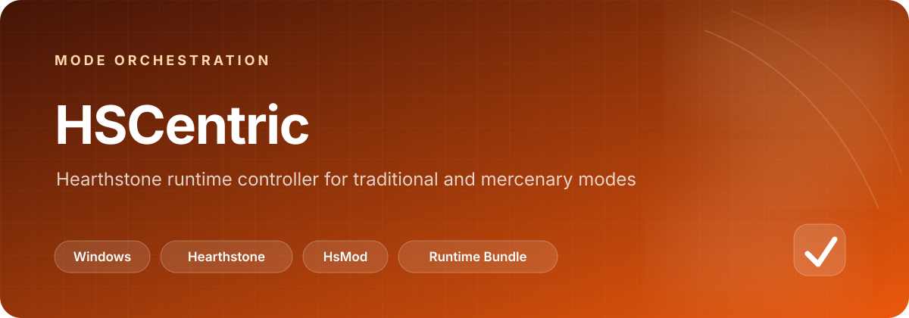

# HSCentric

  

  
  
  
  

<a href="#说明">前置组件</a> · <a href="#切换原理">切换原理</a> · <a href="#已知问题">已知问题</a>

## 一眼看懂

| 维度 | 说明 |
| --- | --- |
| 定位 | 在传统模式与佣兵模式之间切换配置并拉起对应炉石运行组件 |
| 依赖 | HsMod、Mercenary，以及传统对战使用的 HearthBuddy |
| 可复用运行目录 | `default_runtime/BepinEXPlugin` 与 `default_runtime\HSCentric` |
| 当前支持 | 传统 → 佣兵、佣兵 → 佣兵、佣兵 → 传统 |
| 当前限制 | 暂不支持传统对战模式之间的相邻切换；日志无法定时清理 |

> 首次配置完成后，按原说明让中控自动拉起一次游戏再关闭，以完成运行配置。

---

### 说明

1. 需要配合[HsMod(author:Pik-4)](https://github.com/Pik-4/HsMod)使用，HsMod配置如下（用中控拽起会自动设置）

|  key   | value  |
|  ----  | ----  |
| HsMod状态  | true |
| 设置模板  | AwayFromKeyboard |

2. 佣兵部分，需要配合[Mercenary](https://github.com/z-henry/Mercenary)使用，工作在[推荐方式]下
3. 传统对战部分，需要配合[HearthBuddy(author:琴弦上的宇宙)](https://gitee.com/UniverseString/Hearthstone-myHearthbuddy)使用
4. 佣兵插件部分（含1和2的二进制文件），可以直接拷贝
`default_runtime/BepinEXPlugin`到`你的炉石根目录/BepInEx/plugins`
5. 中控运行环境，可以直接使用
`default_runtime\HSCentric`
6. 配置好账号后，使用中控自动拉起一次游戏后关掉，既可完成配置

### 切换原理
切换`io.github.jimowushuang.hs.cfg`配置，启动炉石、HearthBuddy

1. `传统模式`切换到`佣兵模式`
配置切换

|  key   | value  |
|  ----  | ----  |
| 插件开关  | `true` |
| 插件运行模式  | `挂机收菜、刷图等` |
| 使用的队伍名称  | `你的佣兵队伍` |
| 战斗策略  | `你的佣兵策略` |

启动炉石

2. `佣兵模式`切换到`佣兵模式`
配置切换

|  key   | value  |
|  ----  | ----  |
| 插件开关  | `true` |
| 插件运行模式  | `挂机收菜、刷图等` |
| 使用的队伍名称  | `你的佣兵队伍` |
| 战斗策略  | `你的佣兵策略` |

启动炉石

3. `佣兵模式`切换到`传统模式`
配置切换

|  key   | value  |
|  ----  | ----  |
| 插件开关  | `false` |

启动炉石、HearthBuddy

4. `传统模式`切换到`传统模式`
目前暂不支持

### 已知问题
1. 无法进行传统对战之间的相邻切换（经典、休闲、标准、狂野）
2. **不改了** ~~多个炉石同时启动不delay，插件可能无法加载（目前delay 5秒）~~
3. **已解决** ~~兄弟不识别佣兵模式，所以在挂传统模式前，挂pvp，并且间隔10分钟左右（pve不操作就不会结算，而pvp超时对手就把你解决了）~~
3. **已解决** ~~佣兵插件不识别传统模式，所以在挂佣兵模式前，挂传统需要间隔10分钟左右（超时对手就把你解决了）~~
4. 日志无法定时清理
5. **已解决** ~~多实例炉石，共通监控`Logs/hearthstone_日期.log`的日志更新时间，这导致无法判断某个炉石卡死的情况（绑定炉石实例与日志启动时间点）~~
